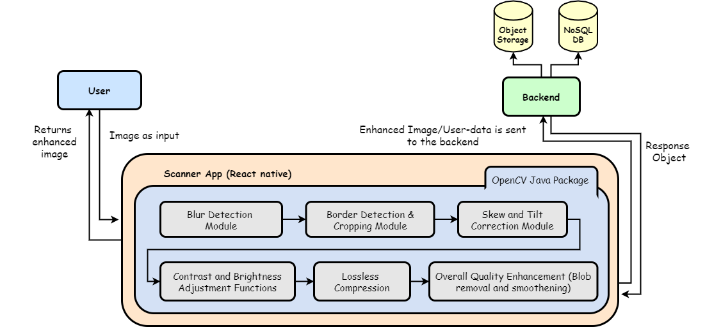

# Document Scanner

This project is a working demo for the implementing opencv as a native module in react (react-native).
This is project is built in HackRX hackathon.

Process flow diagram -

Demo -

